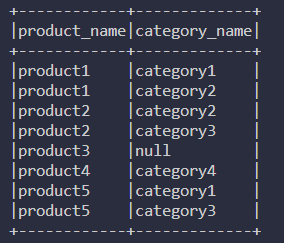

## Clone repo
    git clone https://github.com/EfremovEgor/test_case_lib.git
# Задание 1
## Run Tests
	python3 .\shapes_lib\tests.py
	
# Задание 2
Данные хранятся в csv файлах
## Run spark
    cd .\pyspark_\
    pip install -r requirements.txt
	python3 main.py
    
